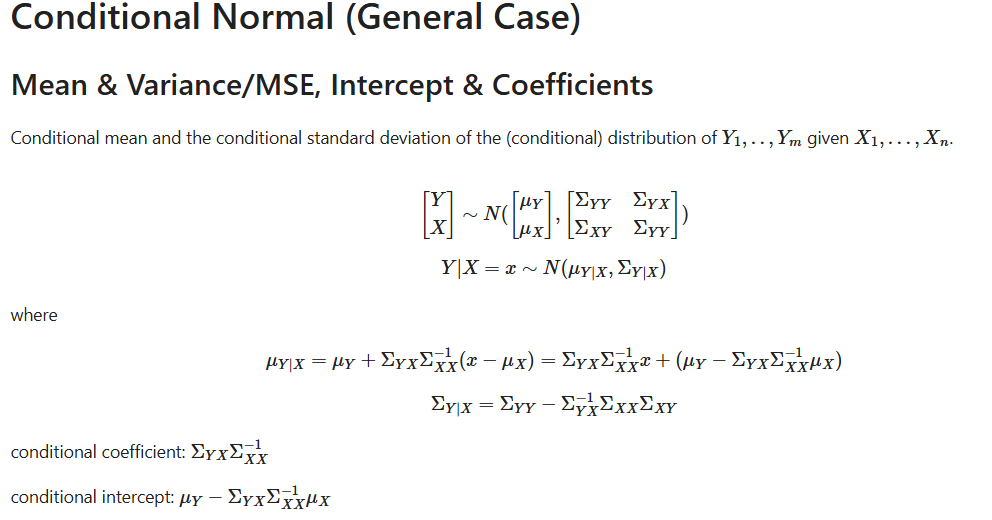

# Conditional Gaussian (Multivariate Normal) Calculator 
This is executible tool build by python to calculate Conditional Guassian's Mean & Variance(MSE), Intercept & Coefficients.

## Theory

Download the executible file and follow the instruction, then you can get a free and convinent Conditional Gaussian (Multivariate Normal) Calculator !
