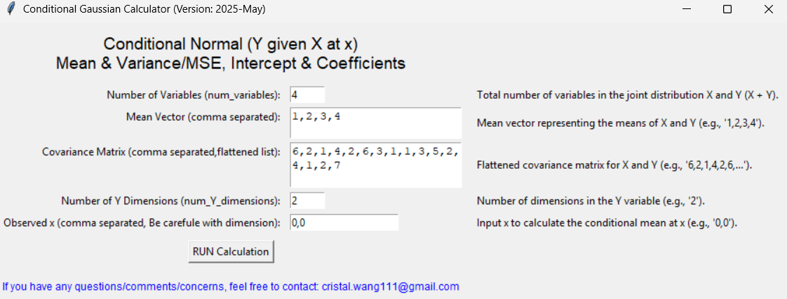
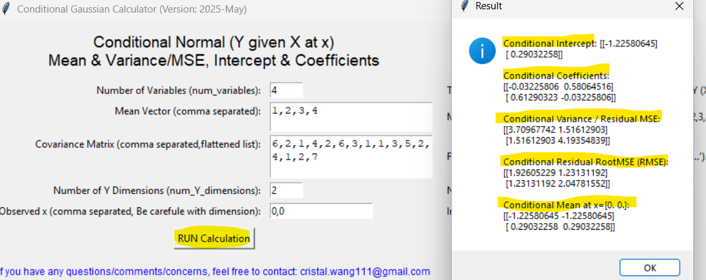

# Conditional Gaussian (Multivariate Normal) Calculator 📱🧮💹📉📈
This is executible tool build by python to calculate Conditional Guassian's Mean & Variance(MSE), Intercept & Coefficients.
This project is built based on the theory discussed in [Theory_Conditional_Normal.ipynb](Theory_Conditional_Normal.ipynb). Click the link to view the notebook.

## Theory 📑

##
### Step1. Download the executible file
Click and download [ConditionalNormal.exe](ConditionalNormal.exe)
Then open 

### Step2. Modify the Inputs ⌨️
Notice there has default testing case, you could ignore (remove) and use your own.

### Step3. Click Run ✅

Yeahh! You got one free and convinent Conditional Gaussian Calculator 🥳!! 
